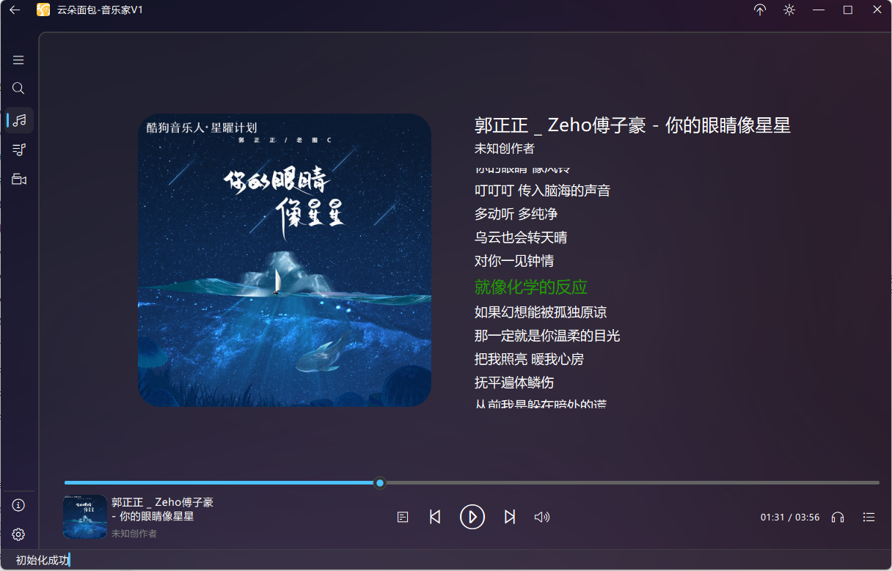
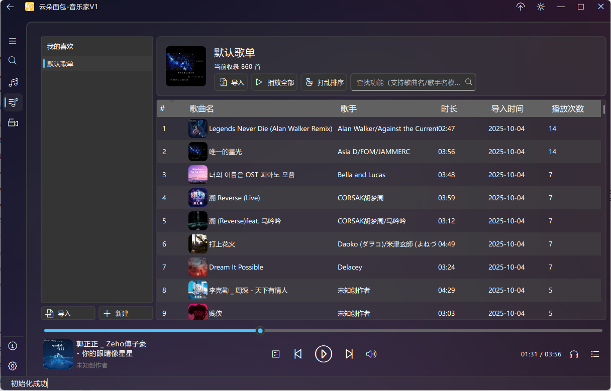

云朵面包 - 音乐家

***

## 项目简介

云朵面包 - 音乐家是**云朵面包系列软件**的音乐功能专项验证工具，专注于解决直播场景与本地播放的歌词同步需求。

核心定位为：支持逐字歌词自动匹配的本地播放器，可通过 H5 插件模式嵌入 OBS、直播姬等直播软件，同时集成基于 VOSK 的语音识别字幕功能，兼顾本地听歌与直播互动场景。

## 快速开始

1. 前往右侧 [Release 页面](https://github.com/CrispyCatshark/CloudBread-Branch-Music/releases) 下载安装包

2. 建议选择 **最新稳定版** 以获取完整功能与 bug 修复

3. 安装后直接启动，支持 Windows 系统（基于 MSVCP2019 编译，若提示缺失运行库请安装 [VC++ 2019 运行时](https://learn.microsoft.com/zh-CN/cpp/windows/latest-supported-vc-redist?view=msvc-170)）

   

## 核心功能

| 功能分类     | 具体能力                                                     |
| ------------ | ------------------------------------------------------------ |
| 本地播放基础 | ✅ 本地音频文件播放（支持主流格式）✅ 歌单管理（创建 / 编辑 / 搜索 / 随机打乱） |
| 歌词同步     | ✅ 自动匹配逐字歌词✅ 手动搜索补充歌词✅ 桌面悬浮歌词显示       |
| 直播场景适配 | ✅ H5 插件模式嵌入直播间（歌词展示）✅ 基于 VOSK 的语音识别字幕 |
| 互动功能     | ✅ 歌单点歌（支持序号点歌 / 随机点歌）                        |

## 计划功能（开发中）

* ✨ 直播间实时点歌互动（观众端触发）

* ✨ 直播间滚动歌词特效（支持自定义样式）

* ✨ 第三方播放器媒体桥接（适配网易云 / QQ 音乐等，同步显示歌词）

  

## 页面预览

### 1. 播放器主页面

*支持播放控制、歌词实时显示*

### 2. 歌单管理页面

*可视化歌单编辑，支持批量添加 / 删除音频文件*

### 3. 直播设置页面

*配置 H5 插件地址、语音识别灵敏度、字幕样式*

### 4. 直播间逐字歌词

*嵌入直播画面的逐字歌词，支持透明度 / 字体自定义*

### 5. 桌面浮动工具

*轻量化控制入口，支持快速切歌、显示当前曲目*

## 源码说明

1. **开发环境**

* 框架：C++ Qt 6.6.2（跨平台支持）

* 编译工具：MSVCP2019（Windows 版本）

* 依赖管理：通过 Qt Creator 或 CMake 构建项目

1. **核心依赖库**

* UI 组件：ElaWidgetTools（Fluent 风格 UI，简化界面开发）

* 网络请求：libhv（轻量级网络库，支持接口请求与数据同步）

* 音频处理：Qt Multimedia（基础播放）+ taglib（音频元数据解析）

  

## 第三方开源库依赖说明

本项目使用以下开源库，感谢各团队的开源贡献。使用时需遵守对应库的授权协议，详细条款请查阅库官方仓库的 LICENSE 文件：

| 库名称         | 用途说明                            | 授权协议                                     | 官方地址                                                     |
| -------------- | ----------------------------------- | -------------------------------------------- | ------------------------------------------------------------ |
| Qt             | 跨平台应用框架（UI / 核心功能支撑） | GPLv3 / LGPLv3（按使用模块区分，见官方说明） | [https://www.qt.io/](https://www.qt.io/)                     |
| ElaWidgetTools | Qt 轻量级 Fluent 风格 UI 组件库     | MIT License（宽松协议，允许商用 / 修改）     | [https://github.com/Liniyous/ElaWidgetTools](https://github.com/Liniyous/ElaWidgetTools) |
| libhv          | 轻量级网络库（接口请求 / 数据传输） | BSD 3-Clause License（宽松协议，需保留声明） | [https://github.com/ithewei/libhv](https://github.com/ithewei/libhv) |
| taglib         | 音频标签解析（元数据读取）          | LGPLv2.1 / MPL 1.1（双协议可选）             | [https://taglib.org/](https://taglib.org/)                   |

## 协议合规提示

1. 本项目已确保对上述开源库的使用符合其授权协议要求，二次开发时需注意：

   * 若修改 Qt（GPLv3 模块）或 taglib（LGPLv2.1）源码，需按协议要求开源修改部分

   * ElaWidgetTools（MIT）与 libhv（BSD）允许商用与闭源修改，但需保留原始版权声明

​	2.项目自身开源协议为MIT，若用于商业场景，建议提前确认依赖库的协议兼容性。